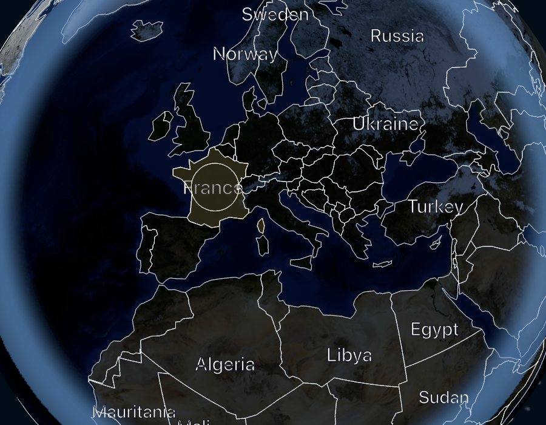

# Atlas Desktop

A native macOS globe: a real, interactive 3D Earth you can rotate, zoom,
and click to learn where countries are — and leave turning slowly on
your desktop.

Everything runs locally. No account, no server, no API key, no analytics,
and no network access at all after installation: the country boundaries,
names, capitals and surface imagery are bundled with the app.



## What it does

- **A real globe.** 177 countries and territories drawn from Natural
  Earth vector data over NASA Blue Marble surface imagery, with crisp
  vector borders that stay sharp at any zoom.
- **Direct manipulation.** Drag to rotate, scroll or pinch to zoom
  between bounded limits, click a country to select it.
- **Country facts.** Name, formal name, capital (or capitals), continent,
  region and ISO 3166-1 identifier. Facts the dataset does not have are
  shown as *Not in dataset* rather than invented.
- **Learning mode.** Hides every label while leaving the globe fully
  interactive; select a country, try to name it, then reveal the answer.
- **Passive rotation.** A slow, calm turn you can pause and resume, which
  yields to your drags and respects the system's Reduce Motion setting.
- **Day and night.** The globe is lit from the sun's current position, so
  the terminator is where it really is (to within a hundredth of a
  degree — see [Accuracy](#accuracy)).
- **Desktop presentation mode.** Puts the globe on your desktop below
  your icons, on every display, still interactive. See
  [Desktop presentation mode](#desktop-presentation-mode) for what macOS
  does and does not allow here.

## Requirements

- macOS 14 or later (Apple silicon or Intel).
- Xcode 16 or later to build. The Command Line Tools alone can build and
  run the app, but see [Building without full Xcode](#building-without-full-xcode).

## Build and run

```bash
git clone https://github.com/KABEER-AHMED/atlas-desktop.git
cd atlas-desktop
Tools/make-app-bundle.sh
open "build/Atlas Desktop.app"
```

`Tools/make-app-bundle.sh` builds a release binary and wraps it in a real
app bundle, which is what gives the app its name, icon, menu bar and
preferences domain. Pass `debug` to build a debug configuration.

For a quick run without a bundle:

```bash
swift run AtlasDesktopApp
```

The window and the globe work, but macOS will show it under a generic
name and icon because a bare executable has no `Info.plist`.

## Test

```bash
swift test
```

138 tests across three suites: the geographic domain, the bundled data,
and the renderer's geometry and layout logic. They are deterministic and
entirely offline.

A rendering smoke check draws the real scene offscreen and writes PNGs,
which needs a GPU but no window and no screen-recording permission:

```bash
swift run AtlasRenderCheck
open build/render-check
```

It fails if the data does not load, if the rendered raster disagrees with
the selection lookup, or if a render comes out blank.

### Building without full Xcode

SwiftUI's `@State` and the testing library's `@Test` are macros, so the
compiler needs their plugins. A full Xcode install provides them. On a
machine with only the Command Line Tools, `Tools/toolchain-flags.sh`
prints the flags that point the compiler at the plugins it is missing:

```bash
swift build $(Tools/toolchain-flags.sh)
swift test  $(Tools/toolchain-flags.sh)
swift run   $(Tools/toolchain-flags.sh) AtlasRenderCheck
```

Note the placement for `swift run`: anything after the product name is
passed to the program, not to the compiler.

The script prints nothing when the active toolchain is a full Xcode, so
it is harmless to use unconditionally. `Tools/make-app-bundle.sh` already
applies it.

## Controls

| Action | Pointer | Keyboard |
|---|---|---|
| Rotate | Drag | Arrow keys (hold Shift for larger steps) |
| Zoom | Scroll or pinch | `+` / `-`, or ⌘+ / ⌘- |
| Select a country | Click it | ⌘F, then search and press Return |
| Clear the selection | Click open ocean | Globe ▸ Clear Selection |
| Pause or resume rotation | Toolbar button | Space, or ⇧⌘R |
| Learning mode | Toolbar button | ⌘L |
| Reveal or hide the answer | Panel button | Globe ▸ Reveal/Hide Answer |
| Reset the view | Toolbar button | ⌘0 |
| Desktop presentation | Toolbar button | ⌃⌥⌘D |
| Settings | — | ⌘, |

Every one of these is also in the menu bar item in the system status bar,
which is how you leave presentation mode if the app's window is closed.

## Desktop presentation mode

macOS offers no public API that lets an ordinary app *become* the
wallpaper. There is no supported way to guarantee that a third-party
window sits beneath the desktop icons on every Space, display and Stage
Manager configuration, and this app will not use private APIs, injection,
Accessibility automation or screen recording to fake it.

What it does instead is a borderless window, one level below the desktop
icon layer, on every display, joining all Spaces and excluded from
Mission Control cycling. In practice the globe appears on the desktop
behind your windows and below your icons, and stays interactive — your
icons keep receiving their own clicks because they are above it.

Verified on macOS 26: the globe renders full-screen at desktop level
behind Finder windows and the Dock. Behaviour across Stage Manager,
multiple displays, and full-screen apps still needs checking by hand;
see [docs/TESTING.md](docs/TESTING.md).

The mode never activates the app or takes focus when it appears. To leave
it: ⌃⌥⌘D, the View menu, or the menu bar item.

## Data and credits

| | Source | Licence |
|---|---|---|
| Boundaries | Natural Earth, Admin 0 Countries 1:110m (`natural-earth-vector` v5.1.2) | Public domain |
| Names, capitals | Natural Earth, Populated Places 1:110m (same release) | Public domain |
| Surface imagery | NASA Earth Observatory, *Blue Marble: Next Generation* (December 2004, topography and bathymetry) | Public domain, credit requested |

Surface imagery by Reto Stöckli, NASA Earth Observatory. The app shows
these credits in Settings ▸ Data & Credits, generated from the same tool
that generates the data, so they cannot drift apart from it.

The sources are pinned by SHA-256 and re-fetchable:

```bash
Tools/fetch-source-data.sh   # verifies Data/source against pinned checksums
swift run AtlasDataTool      # regenerates the bundled runtime assets
```

Full provenance, the exact join rules, and the known gaps in the data are
in [docs/DATA_AND_LICENSES.md](docs/DATA_AND_LICENSES.md).

## Accuracy

- **Boundaries** are 1:110m — a world-scale dataset. Coastlines are
  simplified by tens of kilometres, so a point right on a coast can fall
  on the wrong side of a border. Disputed and dependent territories
  follow Natural Earth's own treatment; the app takes no position of its
  own.
- **Day and night** uses the low-precision solar position algorithm from
  the Astronomical Almanac: around 0.01° in declination and a few
  arcminutes in longitude. That is an approximation good enough to shade
  a globe, not an ephemeris.
- **Missing facts stay missing.** Nine territories have no capital in the
  dataset and three have no ISO code; the app says so rather than filling
  them in from elsewhere.

## Known limitations

- Selection in presentation mode works, but the globe there is a second
  scene: it does not share a camera with the main window.
- Labels are placed by a deterministic greedy pass, so a dense region can
  show fewer labels than would physically fit.
- The app is signed ad-hoc for local use. Distributing it would need a
  Developer ID certificate, which this repository does not contain.

## Documentation

- [PRD.md](PRD.md) — the V1 product requirements this was built against.
- [docs/ARCHITECTURE.md](docs/ARCHITECTURE.md) — module boundaries,
  coordinate conventions, concurrency, performance strategy.
- [docs/DATA_AND_LICENSES.md](docs/DATA_AND_LICENSES.md) — provenance,
  licences, the conversion pipeline, data gaps.
- [docs/TESTING.md](docs/TESTING.md) — what is tested, what was actually
  run, and what still needs a human on a real Mac.
- [docs/adr/](docs/adr/) — decision records for the renderer, the runtime
  data format, the surface imagery, and presentation mode.
